# Super Animal Royale Data


## Table of Contents 
1. [Introduction](#introduction)
2. [Data Collection](#data-collection)
3. [Data Sanitation](#data-sanitation)
4. [Theories and Findings](#theories-and-findings)
5. [Conclusion](#conclusion)
6. [Calendar](#calendar)
7. [How To Use](#how-to-use)

## Introduction

I wanted to study player behavior in a battle royale style game that pits many players against each other and tries to see who will be the last survivor among them. I wrote a program that automatically joined games and watched them recording player data. After running it for the past few weeks I amassed a considerable amount of data from over 500+ games. 

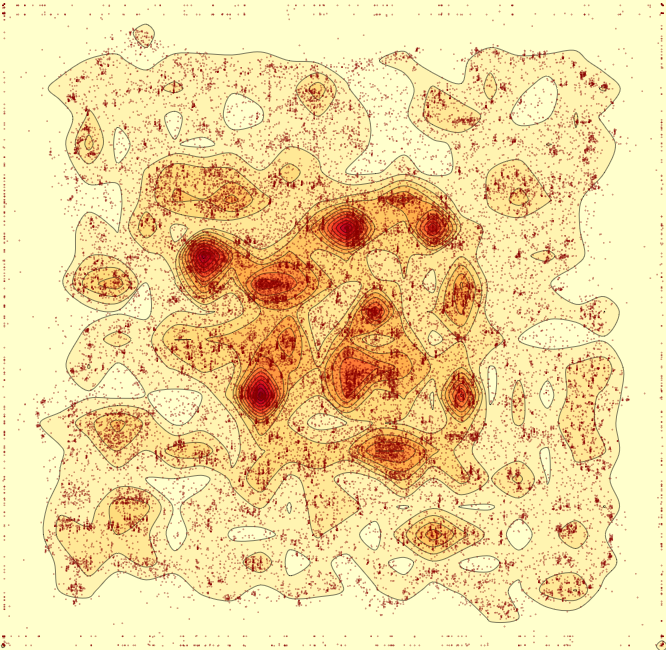 | 
:-: | :-: 

## Data Collection

Data collection was handled by two programs, one that collected the data by reading values straight from the games memory, while the other would automatically join games and avoid getting kicked for inactivity while trying to have minimal impact on the other players. Each game's data gets stored into a json file which has the following fields.

```javascript
"version": uint, //version field was added in v2
"start_time": float, //All times are stored in seconds since unix epoch
"end_time": float,
"flight_start": [float,float], //All positions are stored as a pair [x,y]
"flight_end": [float,float],
"last_gas_center": [float,float],
"last_gas_radius": float,
"players": Player[63], //Array of other players in match, note in v2+ this is sorted from rank 1 to 63
"local_player_info": Player //In v1 this did not exist and the player was simply filtered out

Player {	
	"ranking": uint,
	"jump_position": [float, float],
	"jump_time": float,
	"touchdown_position": [float, float],
	"touchdown_time": float,
	"death_position": [float, float],
	"death_time": float
	"died_in_gas": bool, //Bug in v1, since before gas spawned radius = 0, so every player who died was considered to have died to gas, fixed in v2

	//Used when data gathering, not relevant for analysis
	"last_in_flight": bool,
	"last_is_parachuting": bool,
	"last_is_dead": bool
	"local_player": bool, 
    
}

//Also used when data gathering, not relevant for analysis
"game_started": bool, 
"game_ended": bool,
```
* Note: v1 and v3 data had bugs, data analyzed was mostly v2, with some select v3 data.

## Data Sanitation

Due to the nature of how memory is deallocated after each game, and how the game engine handles player data, occasionally data was misrecorded, or recorded null bytes. As a result `check.js` is used to screen the data, in an attempt to ensure its validity. It logs the name and date of each file being analyzed and below will log any errors in the data.

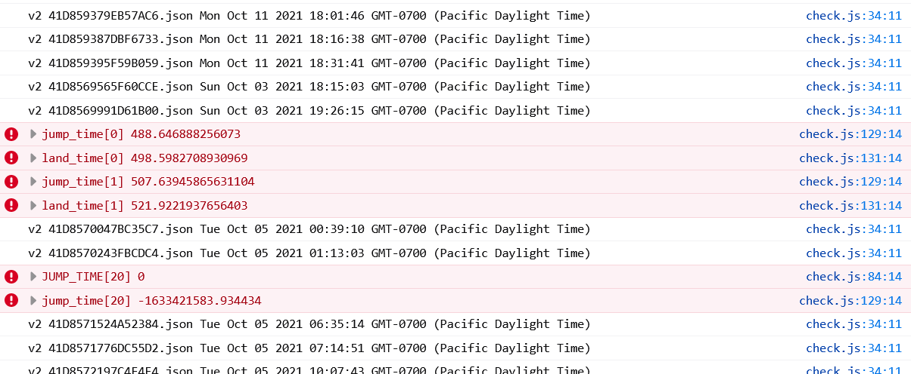

It does various checks like verifying the order of deaths, making sure they are within the time span of the game, checking player positions to ensure they are valid and other miscellaneous checks. Through this I was able to weed out any contaminated data sets. I have separated the data into three sets.

- `./data/clean/*` All the data(v2 and v3) that I am using in my analysis
- `./data/dirty/*` All the data that was filtered out because it set off various flags while being verified
- `./data/v1/*` Unfiltered v1 data which has a known bug relating to died_in_gas 

## Theories and Findings

I did not go into this project with any particular hypothesis to test. I just wanted to analyze the data and try to make observations and reason out why it turned out how it turned out.

### Gas deaths

 | 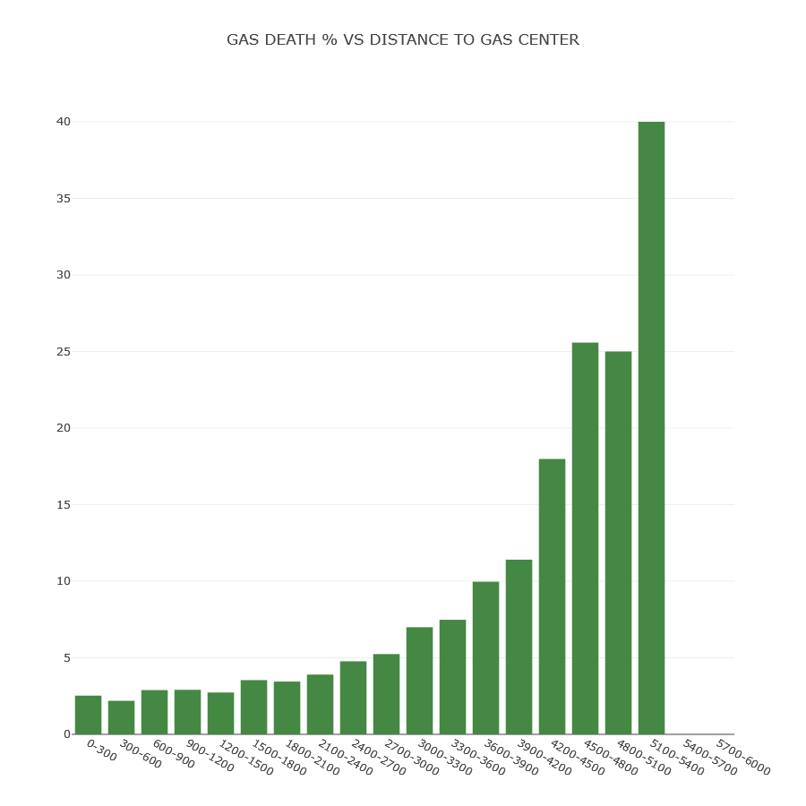
:-: | :-:

The area the player can land on the map including the ocean being about 4600 x 4600 units. Most players have to travel a fair distance across the map to reach the gas center usually anywhere from 500 to 2500 units. The furthest ever a recorded player dropped was about 5554 units away from the gas center, and the closest was 7 units. 

For scale each grid square on the map is 575 x 575 units.


The chance to die in the gas increases with the distance a player lands from the center. You could attribute this to the longer distance making it harder to escape the gas and that certainly is involved. However, in practice the percentage of deaths is likely inflated by inactive players, who automatically drop when the flight reaches the edge of the world. As a result they will be far from the gas center, and since they are inactive they will die to the gas when it reaches them. 

In an average game less than 5% of players die while in the gas, which out of the 64 total, is around 3-4 players out of the whole lobby. This could mean the gas is not a huge threat but it could also mean that players have learned to avoid it. Either way this is far less than I initially expected. It makes sense since you can almost always outrun the gas while rolling and during the first few rings it deals very little damage, and you can easily out heal it.

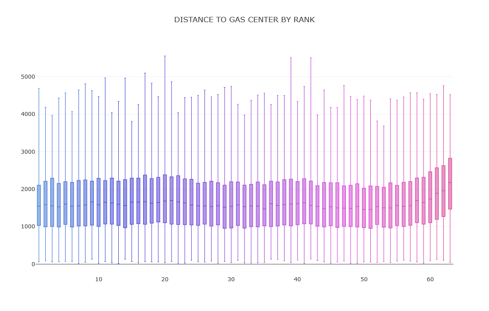 | 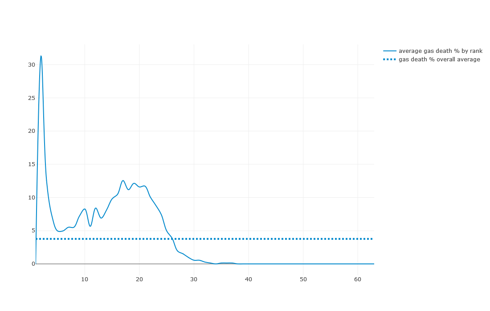
:-: | :-:

How far away a player drops appears to have little influence on the final ranking. The only exception are the people who died first, who tend to be the people who dropped earlier and closer to the edge of the island near the start of the game and as a result are further away on average. 

The percentage of players who died to gas increases greatly as the game goes on. This makes sense as many players die before the first gas ring appears. Even inactive players in a remote region of the map can survive for a considerable amount of time. And since the gas deals more damage with every consecutive ring it makes sense that it would be much more dangerous later on as players are fighting for a very limited amount of space.

NOTE: Gas deaths are counted if the player happened to be standing in the gas when they died, they need not have died from the gas itself.

### Drop times

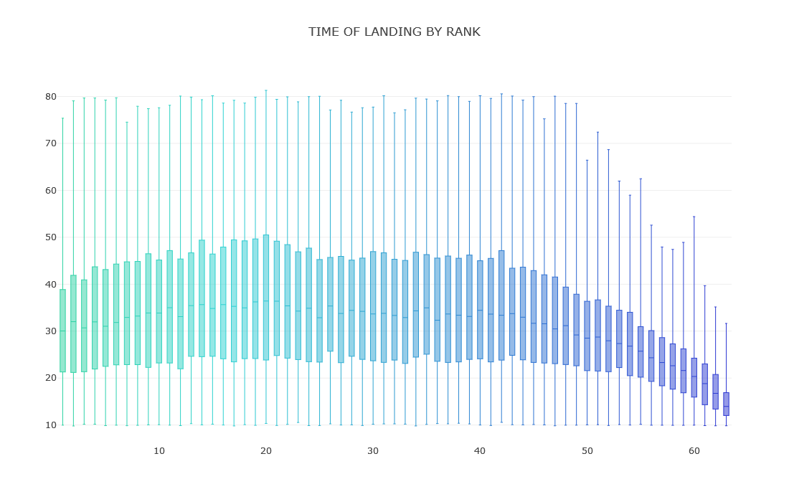 | 
:-: | :-: 

Every rank has a wide distribution of when players choose to jump and when they subsequently land. The only definitive trends are towards the lower and higher ranks. The lower ranks are the players who died the earliest in the game by getting into fights first, so they must have landed sooner than most, and the data confirms this. In the middling ranks the times plateau until reaching the last few ranks where players jump slightly sooner. This is pure speculation but I would expect this is a result of higher ranking players being more experienced and less hesitant when choosing a place to land. The data also shows a clear maximum and minimum amount of time that can be spent dropping which is a good sign for the integrity of the data.

 | 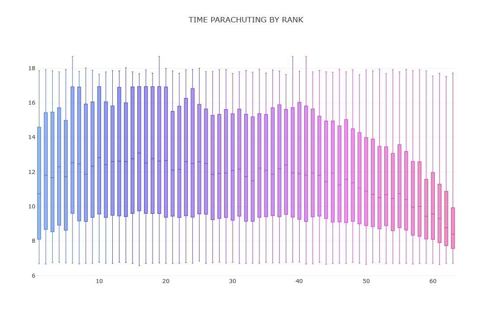
:-: | :-: 

An average player drops around 21 seconds after the match starts, and lands 33 seconds after the match starts. Though the lowest ranking players who jump early on in the match bring down this average considerably. The game also has a mechanic where you can fall faster to reach the ground before other players. As expected it follows a similar trend with the lowest ranking players typically dropping the fastest and spending the least time in the air.

### Distances travelled

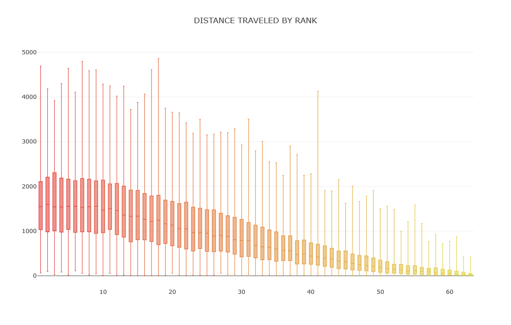 | 
:-: | :-: 

The distance travelled increases consistently with the ranking of the player, as players that survive longer travel further and further as the gas pushes them to around the map. Velocity on the other hand tells a much more interesting story. It reflects how the game plays out for different groups of players, the lowest ranking players die quickly and do not get the chance to travel very far, instead getting into a fight early on. Middle ranking players tend to travel a lot further as a result of the gas pushing them often far across the map. As the rings get smaller less travelling is required and it becomes more a competition of defending territory meaning the highest ranking players will move slower on average. 

NOTE: The distance travelled is calculated as a straight line from their landing point to their death point.

 | 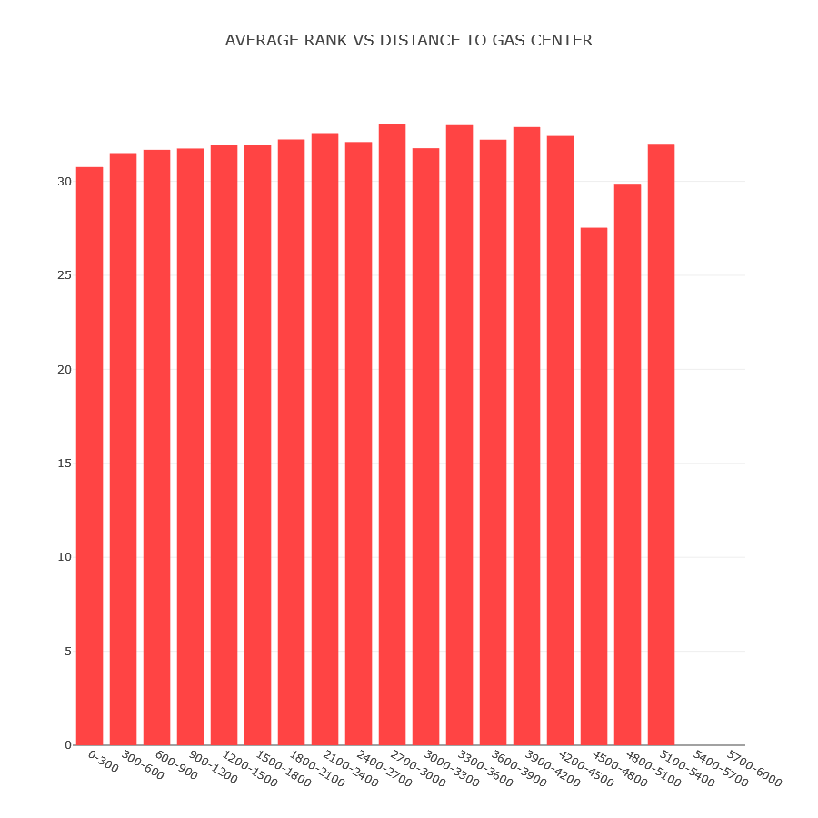
:-: | :-: 

The distance to map center and gas center seems to have very little impact on rank. The only players who are noticeably further from the map center are the lowest ranking because they likely dropped early towards the edge of the island as implied by the drop statistics. The average rank vs distance to the gas center is consistently around 32 which is the average rank for a player in a game of 64 players, so it plays little part in the final rank.
 
### Deaths

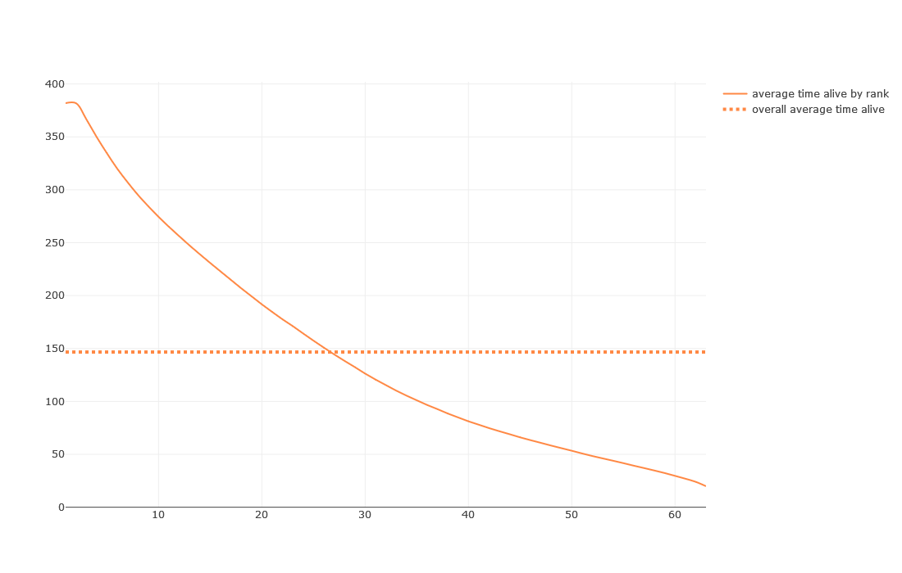 | 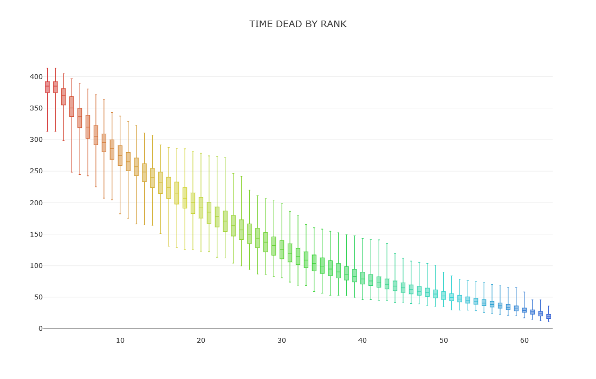
:-: | :-: 

The plots show the pace of the game, and the rank 1 player shows the distribution of how long the game lasts. The average game lasts 385 seconds with an average player not even surviving close to half of the game, 147 seconds. This makes sense from a game design point of view as it would be unsatisfying to die after investing minutes in the game doing nothing. You would rather want many players to get culled early on who can just queue for another game, and in turn lowering queue times for other players.

NOTE: Rank 1 player does not die so the time is just the game length.

### Density Distributions

I am really proud of how theses turned out and it was what I was looking forward to seeing when I began this project. Many of the graphs support previous explanations I have brought up and they also show how accurate the gathered data really is with very finite details being discernable.


The most popular locations are the major structures towards the center of the map. Just from the drop markers you can make out the outlines of many of the major structures on the map. There is also a ring of inactive players who got dropped around the edge of the map in the ocean, which aligns with the other data.


Similarly this map tells us a lot about player behavior. We can make out roads on the map that players travel along, and even the individual corridors in buildings like the Pyramid, Animal Farm, and the left building of Saw Research Labs. Similarly the deaths create an almost perfect outline of the island. This is because whenever a player lands in the ocean as many inactive players do, they will be teleported to the beach nearest to them and hence when they die there they create a clean outline of the island. 


This is more a confirmation of previous findings but most players tend to drop somewhere around the center. Even the individual lines of players dropping from a flight can be discerned.

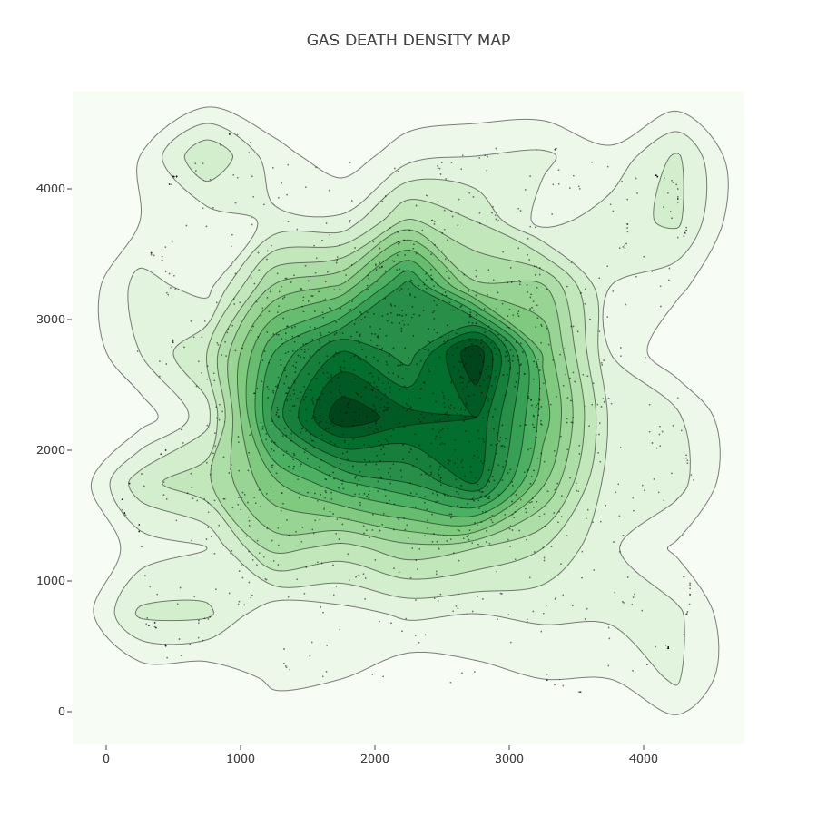 | 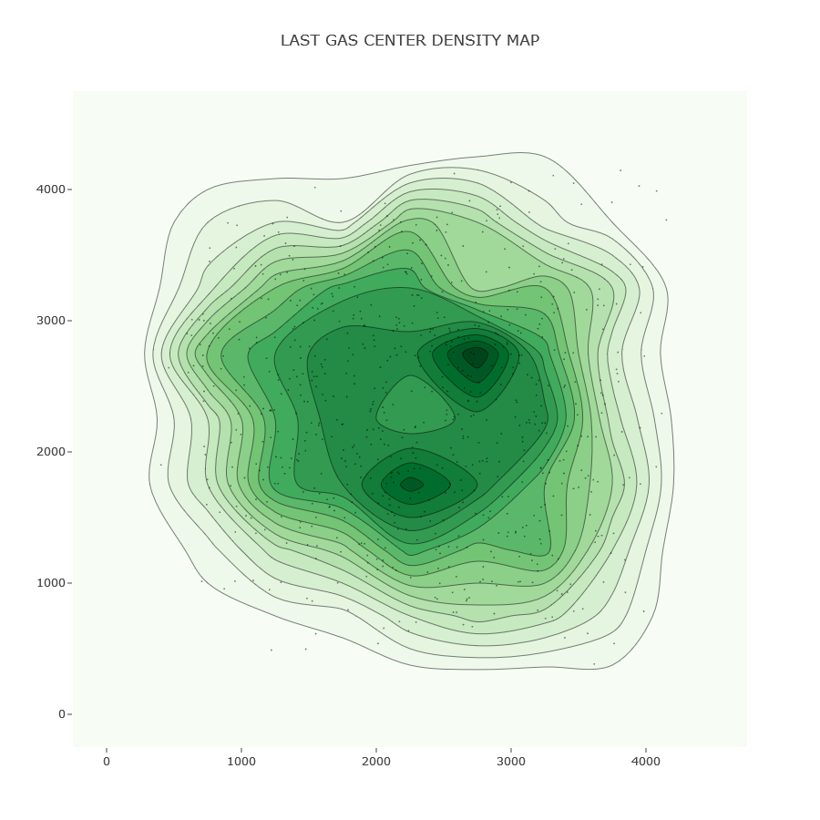
:-: | :-: 

Later in the game players are more likely to die to the gas so it makes sense that many of the deaths are toward the center of the map, where the gas ends. I would have expected more players to die on the outskirts of the map due to gas deaths. Maybe they are killed by players looking for an easy kill or they come back before the gas reaches them. Either way it runs counter to what I postulated earlier about gas deaths vs distance being inflated by inactive players. 

As for the gas center distribution I expect this is a result of the gas ring's center needing to always be on land, so this leads to the densest regions being towards the center. 

### Rank determinism

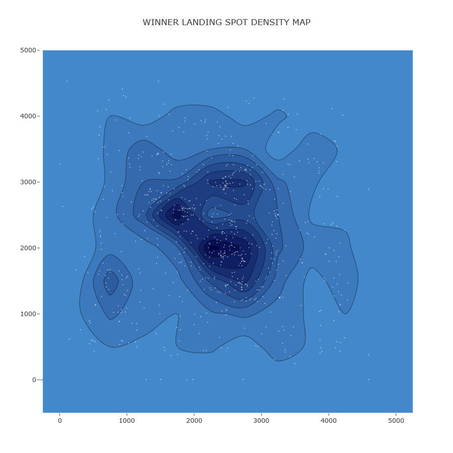 | 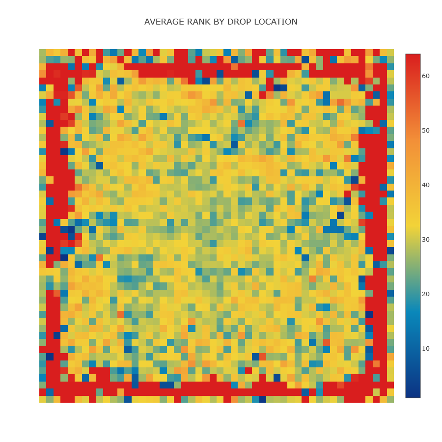
:-: | :-: 

The winner distribution looks at a glance very similar to the overall player distribution and while there are differences I would chalk those up to the smaller sample size of winners. As for the heatmap of average ranks is very noisy and largely inconclusive due to the limited sample size per region make of it what you will.

NOTE: Spots where no players landed on the heatmap were filled as 64(red).

## Conclusion

This was my October 2021 project, it was mostly me getting my feet wet in data engineering and a bit of data analysis. I do not expect that I will be updating this project or collecting more data. I was contemplating adding features like weapon and kill data but my attempts at it were horribly buggy, but maybe I will revisit it at some point.

Unfortunately I cannot release the actual data gathering program. The process of reverse engineering the game to pull data about other players is already a grey area. With the information it collects you could use very similar methods to write cheats for the game and I do not want to enable that.

Hopefully for whatever data science related project I try my hand at next I can make some models rather than just stop at a very basic analysis.

## Calendar

Calendar of when game data was recorded

**October**
|Mon|Tue|Wed|Thu|Fri|Sat|Sun|
|:-:|:-:|:-:|:-:|:-:|:-:|:-:|
|-|-|-|-|1 - **0**|2 - **0**|3 - **48**|
|4 - **95**|5 - **96**|6 - **67**|7 - **40**|8 - **33**|9 - **85**|10 - **13**|
|11 - **134**|12 - **0**|13 - **54**|14 - **0**|15 - **60**|16 - **0**|17 - **0**|
|18 - **0**|19 - **0**|20 - **0**|21 - **0**|22 - **0**|23 - **0**|24 - **0**|
|25 - **0**|26 - **0**|27 - **0**|28 - **0**|29 - **0**|30 - **0**|31 - **0**|

134 + 85 + 33 + 67 + 96 + 48 + 54 + 13 + 40 + 95 + 60
= 725 games of data

## How To Use

Download the repository and open index.html in your browser. Select the json files (shift click on two, highlight multiple files, or select all with CTRL + A) of the games you want to analyze and it will output all the plots for you. The plots are generated using plotly js so feel free to reference there documentation if you want to make your own or modify the existing ones.